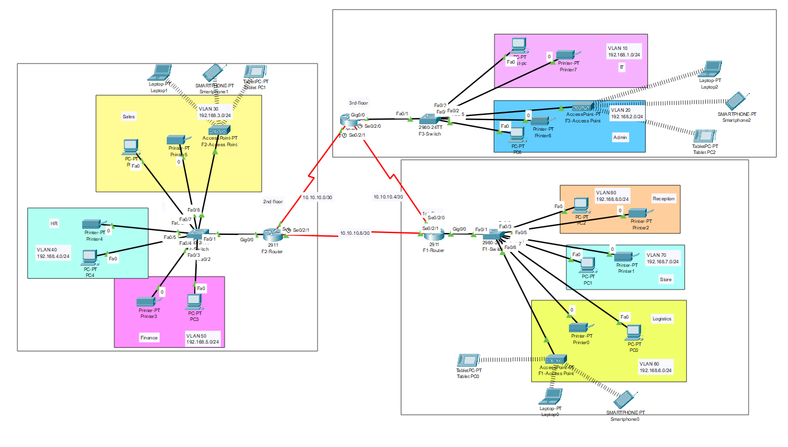

# 🏨 Vic Modern Hotel Network Topology

This project was developed as part of the Networking and Infrastructure Track using Cisco Packet Tracer.

---

## 🚀 Project Overview

A complete Layer 2 and Layer 3 network infrastructure design for **Vic Modern Hotel** consisting of three interconnected floors. The network is segmented using VLANs to separate departments, improve security, reduce broadcast traffic, and simplify network management.

The design includes Router-on-a-Stick implementation, VLAN segmentation, trunking, static routing, wireless connectivity, and secure device management.

---

## 📸 Network Topology

---

## 🏢 Hotel Structure

### First Floor
- Reception Department
- Store Department
- Logistics Department

### Second Floor
- HR Department
- Finance Department
- Sales Department

### Third Floor
- IT Department
- Administration Department

---

## 🛠️ Implemented Features & Technologies

### 🔹 VLAN Segmentation

The network is divided into multiple VLANs to isolate departments and improve security.

| VLAN | Department | Network |
|--------|-------------|-------------|
| 10 | IT | 192.168.1.0/24 |
| 20 | Admin | 192.168.2.0/24 |
| 30 | Sales | 192.168.3.0/24 |
| 40 | HR | 192.168.4.0/24 |
| 50 | Finance | 192.168.5.0/24 |
| 60 | Logistics | 192.168.6.0/24 |
| 70 | Store | 192.168.7.0/24 |
| 80 | Reception | 192.168.8.0/24 |

---

### 🔹 Inter-VLAN Routing

- Router-on-a-Stick configuration
- Subinterfaces created for each VLAN
- Communication enabled between all departments

---

### 🔹 Static Routing

Static routes were configured between the three floor routers.

| Connection | Network |
|------------|----------|
| Floor 1 ↔ Floor 2 | 10.10.10.8/30 |
| Floor 2 ↔ Floor 3 | 10.10.10.0/30 |
| Floor 1 ↔ Floor 3 | 10.10.10.4/30 |

---

### 🔹 Wireless Connectivity

Each floor includes:

- Access Point
- Laptop
- Smartphone
- Tablet

Providing wireless connectivity to users within their respective VLANs.

---

### 🔹 Trunking

IEEE 802.1Q trunk links were configured between routers and switches to transport VLAN traffic.

---

### 🔹 Security Features

- SSH Remote Management
- Hostname Configuration
- Local User Authentication
- Encrypted Passwords
- Secure VTY Access

---

## 🌐 IP Addressing Plan

| VLAN | Department | Subnet |
|--------|-------------|-------------|
| 10 | IT | 192.168.1.0/24 |
| 20 | Admin | 192.168.2.0/24 |
| 30 | Sales | 192.168.3.0/24 |
| 40 | HR | 192.168.4.0/24 |
| 50 | Finance | 192.168.5.0/24 |
| 60 | Logistics | 192.168.6.0/24 |
| 70 | Store | 192.168.7.0/24 |
| 80 | Reception | 192.168.8.0/24 |

---

## 🖥️ Network Devices

### Routers
- Cisco 2911 Routers
- Three routers connecting all floors

### Switches
- Cisco Catalyst 2960 Switches

### End Devices
- PCs
- Printers
- Laptops
- Smartphones
- Tablets

---

## 🎯 Project Objectives

- Improve network security through VLAN isolation
- Reduce unnecessary broadcast traffic
- Enable communication between departments
- Support wired and wireless connectivity
- Provide scalable hotel network infrastructure
- Simplify network administration

---

## 📚 Skills Demonstrated

- VLAN Configuration
- Inter-VLAN Routing
- Router-on-a-Stick
- Static Routing
- Trunk Configuration
- SSH Configuration
- IP Addressing
- Subnetting
- Cisco Packet Tracer
- Network Design

---

## 🛠️ Software Used

- Cisco Packet Tracer
- Cisco IOS
- GitHub

---

## 👨‍💻 Author

**Mostafa Hamdy**

Faculty of Computers and Artificial Intelligence  
Fayoum University

Networking & Infrastructure Enthusiast
